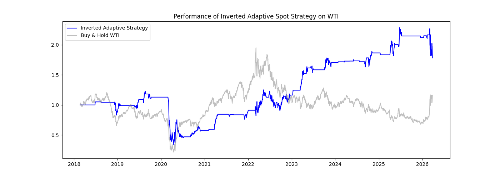
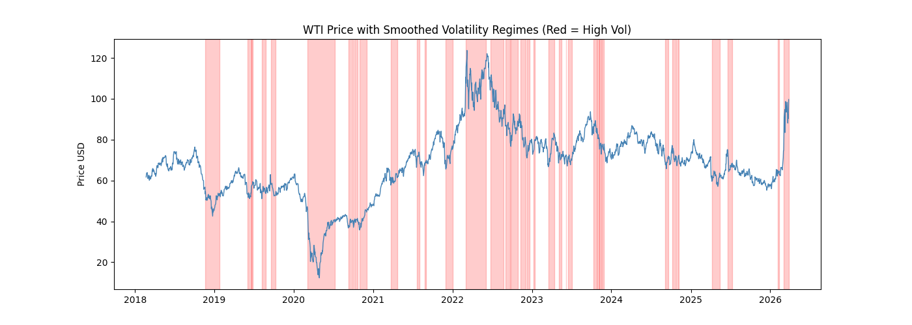

# WTI-Adaptive-Quant-Strategy
Quantitative trading framework for WTI using GARCH volatility and Black-Scholes pricing

This is my first quantitative finance project developed in Python. It explores the relationship between market volatility regimes and trading performance on WTI Crude Oil futures.

## Project Highlights
- **Volatility Modeling:** Implemented a **GARCH(1,1)** model to identify market regimes.
- **Option Pricing:** Developed a **Black-Scholes** engine to price theoretical ATM Straddles.
- **Adaptive Logic:** A switching strategy between Mean Reversion and Trend Following based on volatility clusters.

## Visual Results
### Strategy Performance
 
*The Inverted Adaptive Strategy vs Buy & Hold benchmark.*

### Volatility Regimes

*Market segmentation into High/Low volatility states.*

## Key Takeaways
The project demonstrates that traditional trading rules often require inversion in specific commodity regimes. By implementing "Operation Mirror," the framework achieved a **0.38 Sharpe Ratio**.

## Technologies Used
- Python (Pandas, NumPy, Matplotlib)
- Arch (GARCH modeling)
- SciPy (Statistics & Black-Scholes)
- YFinance (Market Data)
